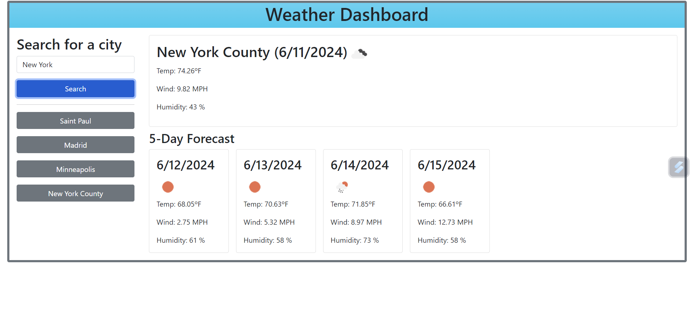

# Weather-API

## Description
The premise behind this creating this project was to understand how to fetch and get data from APIs. The data would then be used to build and create the webpage and by working on this project I was able to understand how to work with APIs and fetch data from them and make sense of the data from the APIs and being able to filter the data which is needed for creating a weather webpage using a weather API's data. The puropse of the webpage is to be able to view the current weather, past search history, and 5-day forecast of different cities when they are searched for by the user.

## Installation
To install the weather-api project you can simply download it from github or just go to the webpage and deploy from there to be able to use it.

## Usage
The weather webpage has various uses like displaying the weather of the current day, other information, the 5-day forecast, and the user's search history of cities so that they can go back to the city they would like the know the weather for. 

## Credits
Documents used:
- Bootstrap: https://getbootstrap.com/docs/5.3/getting-started/introduction/
- DayPicker: https://bootstrap-datepicker.readthedocs.io/en/latest/
- Day.js API: https://day.js.org/docs/en/query/query
- Weather Forecast API: https://openweathermap.org/forecast5
- Geocode API: https://openweathermap.org/api/geocoding-api
